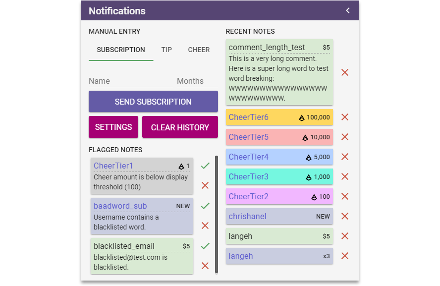

# lfg-nucleus [](https://travis-ci.org/SupportClass/lfg-nucleus)
> Meta bundle that ties together functionality from other "lfg" helper bundles.



lfg-nucleus is useful for normalizing and centrally managing events from multiple other bundles. 
At this time, lfg-nucleus integrates with:
- [lfg-hypetrain](https://github.com/SupportClass/lfg-hypetrain)
- [lfg-siphon](https://github.com/SupportClass/lfg-siphon)@~0.3.0
- [lfg-streamtip](https://github.com/SupportClass/lfg-streamtip)@~0.0.1
- [lfg-sublistener](https://github.com/SupportClass/lfg-sublistener)@^2.0.0

lfg-nucleus depends on:
 - [lfg-filter](https://github.com/SupportClass/lfg-filter)@^2.0.0
 
## Using in your bundle

lfg-nucleus emits two events: `subscription` and `tip`.

### In a graphic or dashboard panel
```js
nodecg.listenFor('subscription', 'lfg-nucleus', function (subscription) {
    // do work
});

nodecg.listenFor('tip', 'lfg-nucleus', function (tip) {
    // do work
});
```

### In an extension
First, add `lfg-nucleus` to your bundle's [`nodecg.bundleDependencies`](http://nodecg.com/tutorial-manifest.html).

Then, create code like the following:
```js
module.exports = function (nodecg) {
    const nucleus = nodecg.extensions['lfg-nucleus'];
    
    nucleus.on('subscription', subscription => {
        // do work
    });
    
    nucleus.on('tip', tip => {
        // do work
    });
};
```

## Data Structures

### Subscription
```js
{
    "name": "langeh",
    "timestamp": 1456809247462,
    "id": "852d1475-6bac-4abe-bcd1-e5805db1caa1",
    "read": false,
    "type": "subscription",
    "channel": "chrishanel",
    "months": 3,
    "resub": true,
    "profileUrl": "https://twitch.tv/langeh",
    
    // Only present when lfg-hypetrain is installed.
    "train": {
        "passengers": 239,
        "dayTotal": 39,
        "threshold": 10,
        "isHype": true
    }
}
```

### Cheer (bits)
```js
{
    "name": "langeh",
    "timestamp": 1456809533513,
    "id": "8f2ea9cb-2e8f-45dd-8645-0b724b2774f6",
    "read": false,
    "type": "tip",
    "amount": 5,
    "currency": "$",
    "formattedAmount": "$5",
    "comment": "Hi streamer!",
    "email": "email@alexvan.camp",
    
    // Will be "daily" or "monthly" if this tip is the top tip of the day or month.
    "top": null
}
```

### Tip
```js
{
    "name": "langeh",
    "timestamp": 1456809533513,
    "id": "8f2ea9cb-2e8f-45dd-8645-0b724b2774f6",
    "read": false,
    "type": "tip",
    "amount": 5,
    "currency": "$",
    "formattedAmount": "$5",
    "comment": "Hi streamer!",
    "email": "email@alexvan.camp",
    
    // Will be "daily" or "monthly" if this tip is the top tip of the day or month.
    "top": null
}
```

